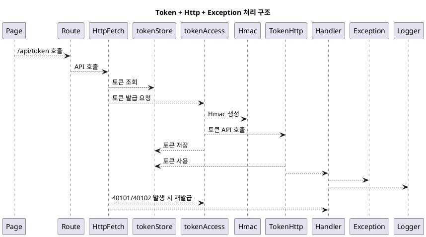
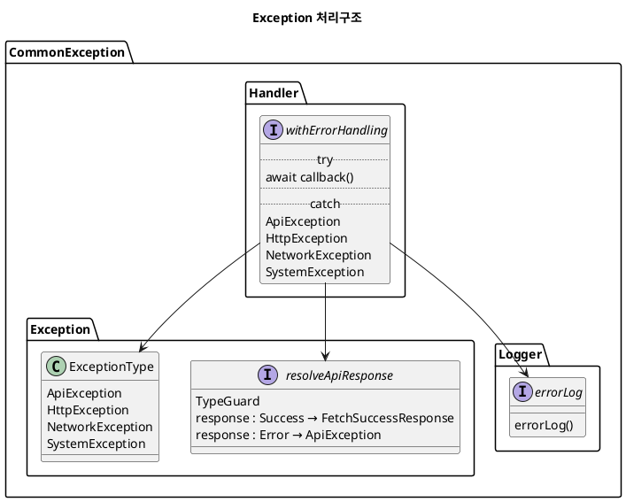

### Directory 경로
```
   app
   ├─ page.tsx -> root cms / 동적site
   ├─ layout.tsx
   ├─ service
   │  └─ BasePageHandler.ts
   ├─ cms -> 관리자 페이지 경로
   │  ├─ page.tsx -> 로그인 세션 검사에 따른 페이지 포워딩(main-session O / login-session X) 
   │  ├─ layout.tsx
   │  ├─ main
   │  │  ├─ page.tsx
   │  │  └─ service
   │  │     └─ ChartRlm1.tsx -> 코드가 길어지거나 외부 솔루션 사용 시 분리
   │  ├─ login
   │  │  ├─ page.tsx
   │  │  └─ service
   │  ├─ mng
   │  │  ├─ strct
   │  │  │  ├─ page.tsx
   │  │  │  └─ service
   │  │  │     └─ StrctEventHandler.ts
   │  │  ├─ menu
   │  │  │  ├─ page.tsx
   │  │  │  └─ service   
   │  │  ├─ conts
   │  │  │  ├─ page.tsx
   │  │  │  └─ service
   │  │  ├─ user
   │  │  │  ├─ page.tsx
   │  │  │  └─ service   
   │  │  ├─ authrt
   │  │  │  ├─ page.tsx
   │  │  │  └─ service   
   │  │  ├─ comCd
   │  │  │  ├─ page.tsx
   │  │  │  └─ service   
   │  │  └─ sysStng
   │  │     ├─ page.tsx
   │  │     └─ service
   components(사용자)
   │  ├─ base
   │  │  ├─ common
   │  │  │  ├─ DynamicPage.tsx
   │  │  │  ├─ DynamicContainerRederer.tsx
   │  │  │  ├─ DynamicFooterRederer.tsx
   │  │  │  ├─ DynamicGnbRederer.tsx
   │  │  │  └─ DynamicPrpgramRederer.tsx
   │  │  ├─ container
   │  │  │  ├─ BasicARlm.tsx
   │  │  │  └─ BasicBRlm.tsx
   │  │  ├─ layout
   │  │  │  ├─ footer
   │  │  │  │  ├─ FooterBasicACrcmf.tsx
   │  │  │  │  └─ FooterBasicBCrcmf.tsx
   │  │  │  └─ gnb
   │  │  │  │  ├─ GnbBasicACrcmf.tsx
   │  │  │  │  └─ GnbBasicBCrcmf.tsx
   │  │  ├─ program
   │  │  │     ├─ ButtonElmn.tsx
   │  │  │     ├─ Dropdown1Elmn.tsx
   │  │  │     ├─ Dropdown2Elmn.tsx
   │  │  │     ├─ JumbotronElmn.tsx
   │  │  │     ├─ RadioListGroupElmn.tsx
   │  │  │     └─ TextElmn.tsx
   │  │  └─ DynamicPage.tsx
   │  └─ cms
   │  │  └─ layout
   │  │     ├─ CmsGnbCrcmf.tsx
   │  │     └─ CmsLnbCrcmf.tsx
   server
   │  ├─ cms
   │  │  ├─ main
   │  │  │  └─ MainApi.ts
   │  │  ├─ login
   │  │  │  └─ LoginApi.ts
   │  │  ├─ mng
   │  │  │  ├─ strct
   │  │  │  │  └─ StrctApi.ts
   │  │  │  ├─ menu
   │  │  │  │  └─ MenuApi.ts
   │  │  │  ├─ conts
   │  │  │  │  └─ ContsApi.ts
   │  │  │  ├─ user
   │  │  │  │  └─ UserApi.ts
   │  │  │  ├─ authrt
   │  │  │  │  └─ AuthrtApi.ts
   │  │  │  ├─ comCd
   │  │  │  │  └─ ComCdApi.ts
   │  │  │  ├─ sysStng
   │  │  │  │  └─ SysStngApi.ts
   │  ├─ common 
   │  │  ├─ api -> API호출
   │  │  │  ├─ exception
   │  │  │  │   ├─ ExceptionType.ts
   │  │  │  │   ├─ ExceptionHandlerUtil.ts
   │  │  │  │   └─ LogUtil.ts
   │  │  │  ├─ EnvUtil.ts
   │  │  │  ├─ HmacUtil.ts
   │  │  │  ├─ HttpApi.ts
   │  │  │  ├─ TokenAccessApi.ts
   │  │  │  ├─ TokenHttpApi.ts
   │  │  │  └─ TokenStoreClass.ts
   styles
   type
      └─ BasePageType.ts
   
           
   ├─└─│     
```

## 명명법
1. 카멜케이스를 기본으로 한다.
2. 기본 tsx(page.tsx, layout.tsx)를 제외한 별도 component 생성은 첫글자를 대문자로 한다.
   - popup , Component명은 {명사}{역할}.tsx
   - ex) ComfirmPopupLayer.tsx
3. Data Handling <u>Component</u>의 경우 접미어(suffix)에 `Api` 를 붙여서 생성 ex) MenuApi
4. 사이트 컨텐츠에 사용되는 <u>Component</u>는 접미어(suffix)에 `Elmn`을 붙여서 생성 ex) ButtonElmn.tsx
5. 사이트 Layout에 사용되는 <u>Component</u>는 접미어(Suffix)에 `Crcmf`를 붙여서 생성
6. 사이트 구성에 사용되는 <u>Component</u>는 접미어(Suffix)에 `Rlm`를 붙여서 생성(Container)
7. Dynamic관련 Renderer는 명명법에서 제외하며 Dynamic{역할}Renderer로 정리하도록 한다.
8. 함수명
    - export default: 파일명
    - function
      - wfc_{대상event명}Event / wfc_{동작명}{주제}By{조건}
      <br> ex) wfc_onClickMainChartEvent / wfc_selectMenuById
      - 조건은 행위가 될 수 없고 데이터를 기준으로 한다.
      - 조건이 없는 경우 `By{조건}`구문을 제거할 수 있다.
      - eventFuntion 은 페이지 종속 , 기능펑션은 private
      - 동작명(함수명)은 sql(CRUD)명령어를 기준으로 한다
        - 만약 CRUD작업 외 연산을 하는경우에는 `is`, `has`, `calcu`
        - sql 쿼리 내용을 그대로 사용하는 경우가 아닌 결과값을 핸들링 하는 경우
        <br>연산 예시 ex) 조회한 내용을 가지고 포함여부 확인(has), 쿼리 내용물로 증명(is) 등
      - API를 호출하는 경우 접두어(prefix)에 `call`을 붙여서 생성
         - ex) call[API명] -> callToken
9. Type, Interface, Class
    - type: 접미어(suffix)에 `Type`을 붙여 생성 -> ex) type MainType 
    - interface: 접미어(suffix)에 `IF` -> ex)interface MainIF
    - class : 접미어(suffix)에 `Class` -> ex)class MainClass
   <br> function명, class구성 내에서는 은 `class`제거 후 작성
10. Util성 파일은 접미어(suffix)에 `Util`을 붙여서 생성
    - ex) EnvUtil.ts
11. 모든 변수 또는 명명에는 단어사전을 참고해서 만들 것
```script
   /DevTeam/프로젝트/W-CMS/doc/0. 분석설계/03.DB/단어정의서
``` 

### 주석
! method
```
/* 
* 용도 :
* 작성자 :
*/
```
! 중간중간 비즈니스로직 내에서는
`` // ``

### 토큰 발급

# 🔐 Token + HTTP + Exception Handling Architecture

> 토큰 기반 인증 + 자동 재발급 + 공통 에러 처리 구조를 통합 설계한 아키텍처

---

## 📌 Overview

본 구조는 API 통신 과정에서 발생하는 인증 및 에러 처리 문제를 해결하기 위해 설계되었습니다.

특히 다음을 목표로 합니다:

* 🔑 토큰 자동 발급 및 관리
* 🔄 만료 토큰 자동 재발급 (Retry)
* ⚠️ 에러 타입별 처리 (Api / Http / Network / System)
* 🧩 공통 Handler를 통한 중앙 집중 처리

---

## 🏗️ Architecture Flow

```text
Page → Route → HttpFetch
                ↓
          Token 검사
        (없음 / 만료)
                ↓
         Token 발급 요청
                ↓
            API 호출
                ↓
       40101 / 40102 발생
                ↓
         토큰 재발급
                ↓
            재요청 (Retry)
                ↓
          Handler → Exception → Logger
```

---

## 📊 Diagram



---

## 🧩 Core Components

### 1. HttpFetch (핵심 진입점)

* API 호출 전 토큰 상태 확인
* 토큰 없거나 만료 시 자동 발급
* 401 에러 발생 시 재발급 후 재요청

```ts
async function HttpFetch(options) {
  let token = tokenStore.getToken();

  if (!token) {
    token = await tokenAccess.callToken();
  }

  try {
    return await fetchWithToken(options, token);
  } catch (error) {
    if (error.code === "40101" || error.code === "40102") {
      const newToken = await tokenAccess.callToken();
      return await fetchWithToken(options, newToken);
    }
    throw error;
  }
}
```

---

### 2. tokenAccess

* 토큰 발급 전용 모듈
* Hmac 기반 인증 처리 후 토큰 요청

```ts
async function callToken() {
  const signature = Hmac.create();
  const token = await TokenHttp({ signature });
  tokenStore.setToken(token);
  return token;
}
```

---

### 3. tokenStore

* 토큰 저장 및 조회 담당 (싱글톤 형태)

```ts
let token = null;

export const tokenStore = {
  getToken: () => token,
  setToken: (newToken) => (token = newToken),
};
```

---

### 4. Handler + Exception

* 모든 에러를 공통 처리
* 타입별로 분류 후 대응

```ts
async function withErrorHandling(callback) {
  try {
    return await callback();
  } catch (error) {
    errorLog(error);
    throw mapToException(error);
  }
}
```

---

## ⚠️ Exception Types

```ts
ApiException
HttpException
NetworkException
SystemException
```

---

## 💡 Design Highlights

* 🔹 **Token Lifecycle 관리 자동화**
* 🔹 **401 에러 기반 재시도 로직 구현**
* 🔹 **에러 처리 중앙 집중화**
* 🔹 **비즈니스 로직과 인증 로직 분리**

---

## 🚀 Why This Matters

이 구조는 단순한 API 호출을 넘어:

👉 인증 + 재시도 + 에러 처리까지 통합한
**실무형 HTTP Client 아키텍처**입니다.

---

## 📁 Suggested Structure

```bash
src/
 ┣ api/
 ┃ ┣ http/
 ┃ ┣ token/
 ┣ exceptions/
 ┣ utils/
 ┗ services/
```

---

## 🔮 Future Improvements

* [ ] Axios Interceptor로 구조 개선
* [ ] Refresh Token 구조 추가
* [ ] 토큰 만료 시간 기반 사전 갱신
* [ ] 에러 모니터링 시스템 연동 (Sentry)

---


### Exception 

# 🚀 Frontend Sprint Project

> 공통 에러 처리 아키텍처를 설계하고 적용한 프론트엔드 학습 프로젝트

---

## 📌 Overview

이 프로젝트는 API 통신 과정에서 발생하는 다양한 에러를 **일관된 방식으로 처리하기 위해 설계된 구조**를 포함합니다.

단순한 try/catch를 넘어,
👉 **에러를 타입별로 분류하고 중앙에서 관리하는 구조**를 구현했습니다.

---

## 🧩 Key Features

* ✅ 공통 Error Handling Wrapper (`withErrorHandling`)
* ✅ API 응답 타입 안전 처리 (`resolveApiResponse`)
* ✅ 에러 타입 분리 (Api / Http / Network / System)
* ✅ 중앙 집중식 로깅 처리
* ✅ 재사용 가능한 구조 설계

---

## 🏗️ Architecture

```text
API Call
   ↓
withErrorHandling
   ↓
resolveApiResponse
   ↓
Success / Error 분기
   ↓
ExceptionType 분류
   ↓
Logger 기록
```

---

## 📊 Diagram



---

## ⚙️ How It Works

### 1. withErrorHandling

모든 API 요청을 감싸는 공통 함수

```ts
async function withErrorHandling(callback) {
  try {
    return await callback();
  } catch (error) {
    // 에러 타입 분류
    // 로깅 처리
    throw error;
  }
}
```

---

### 2. resolveApiResponse

API 응답을 성공 / 실패로 분기 처리

```ts
function resolveApiResponse(response) {
  if (response.success) {
    return response.data;
  }
  throw new ApiException(response);
}
```

---

### 3. Exception Types

```ts
class ApiException extends Error {}
class HttpException extends Error {}
class NetworkException extends Error {}
class SystemException extends Error {}
```

---

### 4. Logger

```ts
function errorLog(error) {
  console.error(error);
}
```

---

## 💡 Design Goals

* 🔹 에러 처리 로직의 중앙 집중화
* 🔹 타입 기반 에러 분류
* 🔹 유지보수성과 확장성 향상
* 🔹 코드 중복 제거

---

## 📁 Project Structure

```bash
src/
 ┣ api/
 ┣ exceptions/
 ┣ utils/
 ┗ services/
```

---

## 🚀 Future Improvements

* [ ] Axios 인터셉터 적용
* [ ] 사용자 친화적 에러 메시지 UI
* [ ] Sentry 연동 (에러 모니터링)
* [ ] 테스트 코드 추가

---

